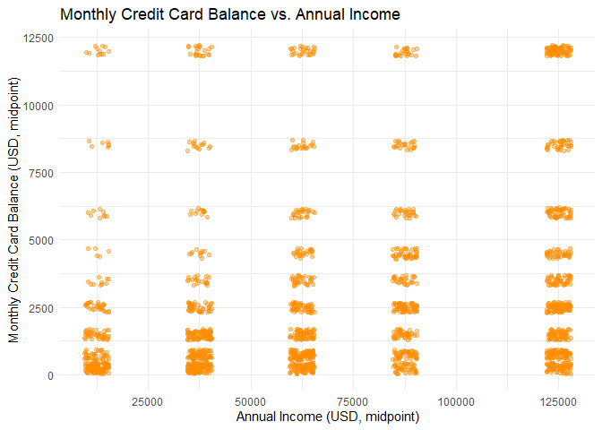
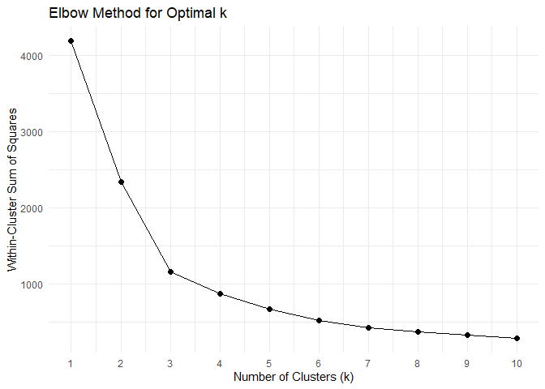
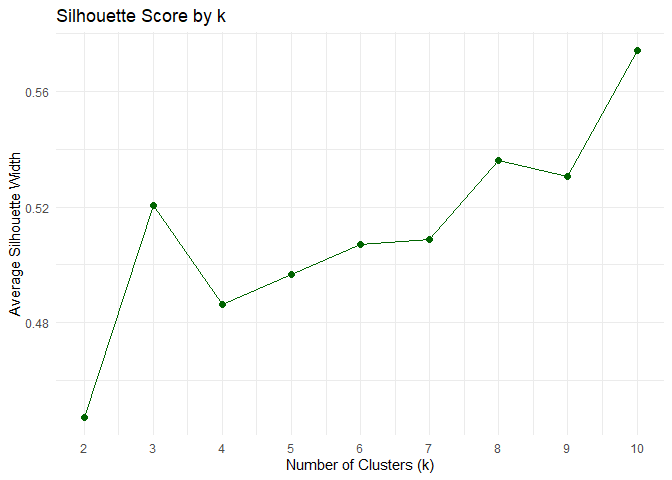
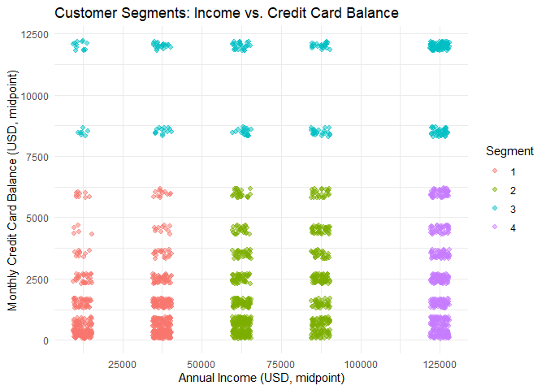
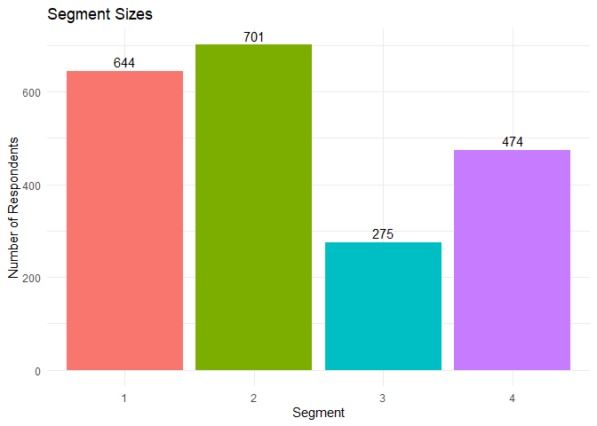
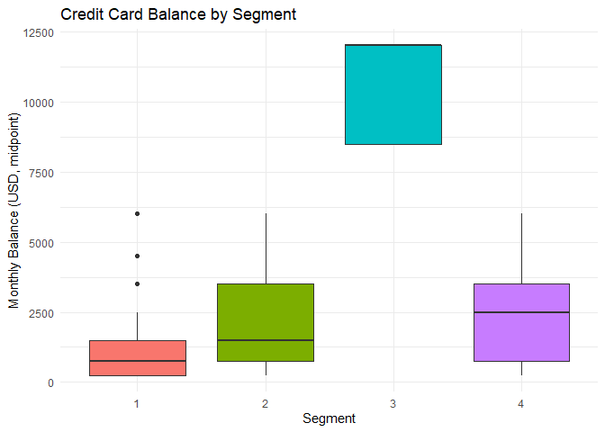

Customer Segmentation Analysis
================
Elvis Boapeah, Prince Adu Poku, Jose A Martinez Morales
2026-07-29

# Introduction

This notebook conducts a customer segmentation analysis on the
`Purchasing_data.xlsx` data set, following the steps outlined in Part B
of the assignment:

1.  Select segmentation variables
2.  Preprocess the data and run clustering in R
3.  Visualize the segments
4.  Interpret the segments and propose a marketing recommendation

We’ll build this up step by step, one chunk at a time.

# Step 0: Load Packages and Data

``` r
library(readxl)
library(dplyr)
library(ggplot2)
library(cluster)
```

The raw file is a qualtrics export with **two header rows**: the first
row holds short question codes (e.g., `Q03`, `D11`), and the second row
holds the full question text. We read the codes as column names and skip
the text row.

``` r
# Short codes (e.g. "Q03", "D11") become the column names
codes <- read_excel("data/Purchasing_data.xlsx", sheet = "Sheet1", n_max = 0) %>%
  colnames()

# Actual response data starts on row 3, so we skip the first two header rows
raw <- read_excel("data/Purchasing_data.xlsx", sheet = "Sheet1", skip = 2, col_names = FALSE)
colnames(raw) <- codes

dim(raw)
```

    ## [1] 4362   89

# Step 1: Exploratory Data Analysis

Before selecting and cleaning our final segmentation variables, let’s
take a closer look at the data set as a whole. The goal here is simply
to understand what we’re working with — not to draw conclusions yet.

We’ll check:

- **Shape**. How many rows and columns the data set has  
- **Data types**.whether each column is being read as text, numeric, or
  something else, since survey data often comes in as character strings
  even when it looks numeric
- **Missing values** — which columns have gaps, and how much
- **Duplicates**Whether any respondent rows are repeated

Once we understand the shape of the data and where the gaps are, we’ll
be ready to move into the actual clustering task: selecting our
segmentation variables, cleaning them, and running k-means.

``` r
cat("Rows:", nrow(raw), " Columns:", ncol(raw), "\n")
```

    ## Rows: 4362  Columns: 89

``` r
dtypes <- sapply(raw, function(x) class(x)[1])
table(dtypes)
```

    ## dtypes
    ## character   numeric   POSIXct 
    ##        86         1         2

``` r
missing_summary <- data.frame(
  Column = names(raw),
  Missing = colSums(is.na(raw)),
  Missing_Pct = round(colMeans(is.na(raw))*100, 1)
) |> arrange(desc(Missing_Pct))

head(missing_summary)
```

    ##       Column Missing Missing_Pct
    ## Q13a    Q13a    2958        67.8
    ## Q14      Q14    2958        67.8
    ## Q11_1  Q11_1    2474        56.7
    ## Q11_2  Q11_2    2474        56.7
    ## Q11_3  Q11_3    2474        56.7
    ## Q11_4  Q11_4    2474        56.7

``` r
n_dupes <- sum(duplicated(raw))
cat("Duplicate rows:", n_dupes, "\n")
```

    ## Duplicate rows: 0

## What we found

- **Shape**: 4,362 rows and 89 columns, matching the data set
  description provided in the assignment.
- **Data types**: 86 columns are character (text/categorical), 1 is
  numeric, and 2 are date columns (survey start/end times tamps). This
  is expected for survey data, where most responses are recorded as
  category labels rather than raw numbers.
- **Missing values**: Missingness is heavily concentrated rather than
  random. The columns `Q13a` and `Q14` have the highest missing rate
  (67.8%), which makes sense since these questions are only shown to
  respondents who indicated they have children (`Q13`). A large block of
  columns is missing at a rate around 52–57% (e.g. `Q11_1`–`Q11_4`,
  `Q06`, `Q07_1`–`Q07_6`), consistent with survey branching and/or
  respondent drop-off partway through the questionnaire, rather than
  random gaps in an otherwise-complete response.
- **Duplicates**: No duplicate rows were found in the data set.

This tells us the data set is clean in terms of duplication, but that
completeness varies significantly by question, meaning our segmentation
variables will need to be chosen with this branching/drop-off pattern in
mind, and any missing values handled by restricting to complete cases
for the specific variables selected, rather than assuming missingness is
random across the whole data set.

## Why We’re Building a Code book First

The raw data set has 89 columns, but their names (`Q01_8`, `D11`, `C1`,
etc.) are just short internal codes. They don’t tell us anything on
their own about what each question actually asked. Before we can
responsibly choose segmentation variables or interpret any results, we
need to understand what every column actually represents.

Rather than looking up each column name individually as we go, we’ll
build a proper code book up front: a table that maps every short code to
its full question text, and then groups related questions into
categories (e.g. Payment Methods, Credit Card Usage, Demographics). This
has a few benefits:

- **It prevents mistakes.** It would be easy to confuse similarly-named
  columns (e.g. `Q07_1` through `Q07_6`, or `D02` vs. `D03`) without a
  clear reference for what each one means.

- **It reveals structure in the survey itself.** Grouping columns by
  category makes it clear that this survey was built from multiple
  sub-topics — payment behavior, credit card usage, BNPL attitudes,
  device ownership, and demographics — which helps explain patterns we
  saw earlier, like the block-wise missingness in our exploratory
  analysis.

- **It documents our reasoning for the report.** When we justify our
  choice of segmentation variables in Step 3, we can point directly to
  this code book to show why `Q03` and `D11` were selected — not just
  that they seemed reasonable, but that we understood the full landscape
  of candidate variables and considered other options (e.g. credit
  score, savings, device ownership) before making that choice.

Once the code book is built, we’ll use it to confirm exactly what our
chosen segmentation variables measure, then move into cleaning and
clustering.

``` r
labels_row <- read_excel("data/Purchasing_data.xlsx", sheet = "Sheet1",
                          col_names = FALSE, skip = 1, n_max = 1)
question_text <- as.character(unlist(labels_row[1, ]))

codebook <- data.frame(Code = codes, Question = question_text, stringsAsFactors = FALSE)

head(codebook, 10)
```

    ##        Code
    ## 1        Q1
    ## 2  End Date
    ## 3     Q01_1
    ## 4     Q01_2
    ## 5     Q01_3
    ## 6     Q01_4
    ## 7     Q01_5
    ## 8     Q01_6
    ## 9     Q01_7
    ## 10    Q01_8
    ##                                                                                                                                                                                Question
    ## 1                                                                                                                                                                            Start Date
    ## 2                                                                                                                                                                              End Date
    ## 3                                                             In the past 12 months, which of the following methods have you used to make payments? Please select all that apply - Cash
    ## 4                                                            In the past 12 months, which of the following methods have you used to make payments? Please select all that apply - Check
    ## 5                                                      In the past 12 months, which of the following methods have you used to make payments? Please select all that apply - Credit card
    ## 6                                                       In the past 12 months, which of the following methods have you used to make payments? Please select all that apply - Debit card
    ## 7                                         In the past 12 months, which of the following methods have you used to make payments? Please select all that apply - Electronic bank transfer
    ## 8  In the past 12 months, which of the following methods have you used to make payments? Please select all that apply - Store cards (cards that can only be used at specific merchants)
    ## 9                              In the past 12 months, which of the following methods have you used to make payments? Please select all that apply - Selected Choice - Gift/prepaid card
    ## 10                                                          In the past 12 months, which of the following methods have you used to make payments? Please select all that apply - PayPal

``` r
category_map <- list(
  "Payment Methods (12mo)"    = c("Q01_1","Q01_2","Q01_3","Q01_4","Q01_5","Q01_6","Q01_7",
                                    "Q01_8","Q01_9","Q01_10","Q01_11","Q01_12","Q01_13","Q01_14","Q01_15"),
  "Credit Card Usage"         = c("Q02","Q03","Q04","Q05","Q06"),
  "Credit Card Purchase Type" = c("Q07_1","Q07_2","Q07_3","Q07_4","Q07_5","Q07_6"),
  "BNPL Behavior"             = c("Q10","Q11_1","Q11_2","Q11_3","Q11_4"),
  "Card Choice Importance"    = c("Q12_1","Q12_2","Q12_3","Q12_4","Q12_5","Q12_6","Q12_7","Q12_8","Q12_9"),
  "Children & Credit"         = c("Q13","Q13a","Q14"),
  "Credit Score"              = c("C1"),
  "Device Ownership"          = c("D01_1","D01_4","D01_5","D01_6","D01_7","D01_8","D01_9","D01_10","D01_11","D01_12"),
  "In-Store Payment Methods"  = c("D02_1","D02_4","D02_5","D02_6","D02_7","D02_8","D02_9","D02_10","D02_11","D02_12","D02_13","D02_14"),
  "Online Payment Methods"    = c("D03_1","D03_4","D03_5","D03_6","D03_7","D03_8","D03_9","D03_10"),
  "Subscriptions"             = c("D04_1","D04_2"),
  "Demographics"              = c("D06","D07","D08","D09","D10","D11","D12","D13","D14","D15","D16"),
  "Survey Metadata"           = c("Q1","End Date")
)
```

``` r
code_to_category <- stack(category_map) %>% rename(Code = values, Category = ind)

codebook <- codebook %>%
  left_join(code_to_category, by = "Code") %>%
  mutate(Category = ifelse(is.na(Category), "Uncategorized", as.character(Category)))
```

``` r
codebook %>% count(Category, sort = TRUE)
```

    ##                     Category  n
    ## 1     Payment Methods (12mo) 15
    ## 2   In-Store Payment Methods 12
    ## 3               Demographics 11
    ## 4           Device Ownership 10
    ## 5     Card Choice Importance  9
    ## 6     Online Payment Methods  8
    ## 7  Credit Card Purchase Type  6
    ## 8              BNPL Behavior  5
    ## 9          Credit Card Usage  5
    ## 10         Children & Credit  3
    ## 11             Subscriptions  2
    ## 12           Survey Metadata  2
    ## 13              Credit Score  1

``` r
knitr::kable(codebook %>% select(Category, Code, Question), 
             caption = "Full Data Codebook")
```

| Category | Code | Question |
|:---|:---|:---|
| Survey Metadata | Q1 | Start Date |
| Survey Metadata | End Date | End Date |
| Payment Methods (12mo) | Q01_1 | In the past 12 months, which of the following methods have you used to make payments? Please select all that apply - Cash |
| Payment Methods (12mo) | Q01_2 | In the past 12 months, which of the following methods have you used to make payments? Please select all that apply - Check |
| Payment Methods (12mo) | Q01_3 | In the past 12 months, which of the following methods have you used to make payments? Please select all that apply - Credit card |
| Payment Methods (12mo) | Q01_4 | In the past 12 months, which of the following methods have you used to make payments? Please select all that apply - Debit card |
| Payment Methods (12mo) | Q01_5 | In the past 12 months, which of the following methods have you used to make payments? Please select all that apply - Electronic bank transfer |
| Payment Methods (12mo) | Q01_6 | In the past 12 months, which of the following methods have you used to make payments? Please select all that apply - Store cards (cards that can only be used at specific merchants) |
| Payment Methods (12mo) | Q01_7 | In the past 12 months, which of the following methods have you used to make payments? Please select all that apply - Selected Choice - Gift/prepaid card |
| Payment Methods (12mo) | Q01_8 | In the past 12 months, which of the following methods have you used to make payments? Please select all that apply - PayPal |
| Payment Methods (12mo) | Q01_9 | In the past 12 months, which of the following methods have you used to make payments? Please select all that apply - Another peer-to-peer payment app (such as Venmo) |
| Payment Methods (12mo) | Q01_10 | In the past 12 months, which of the following methods have you used to make payments? Please select all that apply - - Apple Pay |
| Payment Methods (12mo) | Q01_11 | In the past 12 months, which of the following methods have you used to make payments? Please select all that apply - Selected Choice - Google Pay |
| Payment Methods (12mo) | Q01_12 | In the past 12 months, which of the following methods have you used to make payments? Please select all that apply -Another digital wallet |
| Payment Methods (12mo) | Q01_13 | In the past 12 months, which of the following methods have you used to make payments? Please select all that apply -Buy now, pay later |
| Payment Methods (12mo) | Q01_14 | In the past 12 months, which of the following methods have you used to make payments? Please select all that apply - Cryptocurrency |
| Payment Methods (12mo) | Q01_15 | In the past 12 months, which of the following methods have you used to make payments? Please select all that apply -Other, please specify: |
| Credit Card Usage | Q02 | What is the total number of credit cards you currently own? |
| Credit Card Usage | Q03 | Over the past 12 months, which of the following best reflects your usual monthly credit card balance? |
| Credit Card Usage | Q04 | Do you typically pay off your entire credit card balance each month? |
| Credit Card Usage | Q05 | Considering all the ways you use credit cards—for retail purchases, services like hotels, travel, dining, bill payments, subscriptions, taxes, etc.—approximately what percentage of your purchases in the past 30 days were made using a credit card, compared to other payment methods? |
| Credit Card Usage | Q06 | Over the past two months, has your credit card usage increased, decreased, or stayed the same? |
| Credit Card Purchase Type | Q07_1 | For which of the following purchase types do you typically use a credit card? Please select all that apply |
| Credit Card Purchase Type | Q07_2 | Which types of purchases do you usually pay for with a credit card? Select all that apply. |
| Credit Card Purchase Type | Q07_3 | Which of the following purchase methods do you typically use a credit card for? Select all that apply. |
| Credit Card Purchase Type | Q07_4 | Which types of purchases do you typically use a credit card for? Please select all that apply |
| Credit Card Purchase Type | Q07_5 | For which of the following types of purchases or expenses do you commonly use a credit card? Select all that apply |
| Credit Card Purchase Type | Q07_6 | “Which of the following types of purchases do you typically use a credit card for? Please select all that apply. |
| BNPL Behavior | Q10 | Have you ever used a Buy Now, Pay Later (BNPL) feature offered by your credit card provider? |
| BNPL Behavior | Q11_1 | In each of the following scenarios, how likely are you to use a Buy Now, Pay Later (BNPL) option to complete a purchase? |
| BNPL Behavior | Q11_2 | How likely are you to use a Buy Now, Pay Later (BNPL) option to make a purchase under the following circumstances? |
| BNPL Behavior | Q11_3 | How likely are you to use a Buy Now, Pay Later (BNPL) option when making a purchase under the following conditions? |
| BNPL Behavior | Q11_4 | How likely are you to use a Buy Now, Pay Later (BNPL) option for a purchase in each of the following situations? |
| Card Choice Importance | Q12_1 | There are many credit cards available from different issuers. How important are the following factors in influencing your preference for one credit card over another? |
| Card Choice Importance | Q12_2 | With numerous credit cards available from different issuers, how important are the following factors in shaping your preference for one card over another? |
| Card Choice Importance | Q12_3 | With many credit cards offered by different issuers, how important are the following factors in influencing your choice of one card over another? |
| Card Choice Importance | Q12_4 | With a variety of credit cards available from different issuers, how important are the following features in influencing your choice of a credit card? |
| Card Choice Importance | Q12_5 | With many credit cards available from different issuers, how important are the following factors in influencing your preference for one card over another? |
| Card Choice Importance | Q12_6 | Given the wide range of credit cards offered by different issuers, how important are the following factors in determining your preference for one card over another? |
| Card Choice Importance | Q12_7 | With a variety of credit cards available from different issuers, how important are the following features in influencing your choice of one card over another? |
| Card Choice Importance | Q12_8 | With many credit cards available from different issuers, how important are the following aspects in shaping your preference for one card over another? |
| Card Choice Importance | Q12_9 | With many credit cards available from different issuers, how important are the following factors in determining your preference for one card over another? |
| Children & Credit | Q13 | Do you currently have, or have you previously had, children under your care? |
| Children & Credit | Q13a | Age |
| Children & Credit | Q14 | How important is it to you that your child(ren) establish and maintain a strong credit score? |
| Credit Score | C1 | Credit score |
| Device Ownership | D01_1 | Which of the following smart or connected devices do you currently own or have in your household? Please check all that apply - - Desktop or laptop computer |
| Device Ownership | D01_4 | Which of the following smart or connected devices or products do you own or have in your home?Please check all that apply. - Smartphone |
| Device Ownership | D01_5 | Which of the following smart or connected devices do you currently own or have in your household? Please check all that apply -. - Voice-activated speaker (e.g., Amazon Alexa, Google Assistant) |
| Device Ownership | D01_6 | Which of the following smart or connected devices do you currently own or have in your household? Please check all that apply – Tablet (e.g., iPad, Microsoft Surface) |
| Device Ownership | D01_7 | Which of the following smart or connected devices do you currently own or have in your household? Please check all that apply - Car with built-in connected capabilities |
| Device Ownership | D01_8 | Which of the following smart or connected devices do you currently own or have in your household? Please check all that apply - Connected or smart TV |
| Device Ownership | D01_9 | Which of the following smart or connected devices do you currently own or have in your household? Please check all that apply -. - eReader (e.g., Kindle) |
| Device Ownership | D01_10 | Which of the following smart or connected devices do you currently own or have in your household? Please check all that apply -. - Game console (e.g., PlayStation, Xbox) |
| Device Ownership | D01_11 | Which of the following smart or connected devices do you currently own or have in your household? Please check all that apply - Smartwatch |
| Device Ownership | D01_12 | Which of the following smart or connected devices do you currently own or have in your household? Please check all that apply - Virtual reality headset |
| In-Store Payment Methods | D02_1 | What payment methods do you typically use for in-store purchases?- Credit card |
| In-Store Payment Methods | D02_4 | What payment methods do you typically use for in-store purchases?Debit card |
| In-Store Payment Methods | D02_5 | What payment methods do you typically use for in-store purchases? Store-brand card (can be used only for that store) |
| In-Store Payment Methods | D02_6 | What payment methods do you typically use for in-store purchases? Buy now, pay later (i.e Klarna, Afterpay, Affirm, etc.) |
| In-Store Payment Methods | D02_7 | What payment methods do you typically use for in-store purchases? Cash |
| In-Store Payment Methods | D02_8 | What payment methods do you typically use for in-store purchases? Check |
| In-Store Payment Methods | D02_9 | What payment methods do you typically use for in-store purchases?PayPal |
| In-Store Payment Methods | D02_10 | What payment methods do you typically use for in-store purchases? Apple Pay |
| In-Store Payment Methods | D02_11 | What payment methods do you typically use for in-store purchases? Samsung Pay |
| In-Store Payment Methods | D02_12 | What payment methods do you typically use for in-store purchases? Google Pay |
| In-Store Payment Methods | D02_13 | What payment methods do you typically use for in-store purchases? Cryptocurrency (e.g., bitcoin) |
| In-Store Payment Methods | D02_14 | What payment methods do you typically use for in-store purchases? I never purchase things in stores. |
| Online Payment Methods | D03_1 | What payment methods do you typically use when making purchases online? - Credit card |
| Online Payment Methods | D03_4 | What payment methods do you typically use when making purchases online?- Debit card |
| Online Payment Methods | D03_5 | What payment methods do you typically use when making purchases online?- Selected Choice - Store-brand card (can be used only for that store) |
| Online Payment Methods | D03_6 | What payment methods do you typically use when making purchases online? - PayPal |
| Online Payment Methods | D03_7 | What payment methods do you typically use when making purchases online? - Selected Choice - Apple Pay |
| Online Payment Methods | D03_8 | What payment methods do you typically use when making purchases online?- Google Pay |
| Online Payment Methods | D03_9 | What payment methods do you typically use when making purchases online? - Cryptocurrency (e.g., bitcoin) |
| Online Payment Methods | D03_10 | What payment methods do you typically use when making purchases online? - I never purchase things online. |
| Subscriptions | D04_1 | Are you currently subscribed to Amazon Prime, Walmart+, or both? - Amazon Prime |
| Subscriptions | D04_2 | Are you currently subscribed to Amazon Prime, Walmart+, or both? - Walmart + |
| Demographics | D06 | Gener |
| Demographics | D07 | Year of birth |
| Demographics | D08 | Age Group |
| Demographics | D09 | What is the highest level of education you have completed? |
| Demographics | D10 | Current Employment |
| Demographics | D11 | Considering all sources of income—such as wages, salaries, tips, interest, child support, alimony, investments, rental income, retirement funds, Social Security, and government benefits—what was your approximate total personal income for the year 2020? |
| Demographics | D12 | Marital status |
| Demographics | D13 | Are there any children under the age of 18 currently living in your household? |
| Demographics | D14 | Where do you live? |
| Demographics | D15 | Which of the following statements best reflects your current financial lifestyle? |
| Demographics | D16 | About how much do you currently have in personal or household savings that could be used for emergency expenses? (Savings may include cash, funds in checking or savings accounts, or other assets that can be converted to cash within one day.) |

Full Data Codebook

# Step 3: Preparation for K-means clustering

## Preparation for the K-means clustering

Before we can run k-means clustering, our two selected variables (`Q03`
(monthly credit card balance) and `D11` (annual income)), we need to go
through several preparation steps. Right now they’re stored as text
categories (e.g. `"Between $25,000 and $49,999"`), not numbers, and
k-means can’t work directly with text.

Here’s what we’re doing, and why each step matters:

- **Trimming whitespace.** Survey exports (like this Qualtrics file)
  sometimes have stray trailing spaces on category labels. Without
  trimming, `"Two"` and `"Two "` would be treated as two *different*
  categories instead of the same one, a subtle bug that’s easy to miss.

- **Converting categories to numeric midpoints.** Since both variables
  are reported as dollar *ranges* rather than exact amounts, we convert
  each range to a single representative number (its midpoint) so that
  k-means has actual numeric distances to work with. For example,
  `"$501 to $1,000"` becomes `750`. The open-ended top categories
  (`"More than $10,000"`, `"More than $100,000"`) don’t have a natural
  midpoint, so we chose reasonable representative values. This is a
  judgment call we’ll state explicitly as an assumption in our report.

- **Filtering to complete cases.** Not every respondent answered both
  `Q03` and `D11`. Many dropped off partway through the survey, which we
  already saw in our exploratory analysis. Rather than guessing or
  filling in missing values, we keep only the respondents who have
  *both* variables present, so that every clustering input is a real,
  complete observation.

- **Standardizing (scaling) the variables.** `D11` (income) ranges up
  into the hundreds of thousands, while `Q03` (balance) tops out around
  \$12,000. If we clustered on the raw numbers, income would completely
  dominate the distance calculation just because its numbers are bigger,
  not because it’s actually more important. Standardizing puts both
  variables on the same scale (mean 0, standard deviation 1) so they
  contribute equally to the clustering.

Once this is done, we’ll have a clean, numeric, standardized dataset of
2,094 respondents, ready for k-means clustering.

``` r
df <- raw %>%
  select(Q03, D11) %>%
  mutate(Q03 = trimws(Q03), D11 = trimws(D11))

table(df$Q03, useNA = "always")
```

    ## 
    ##  $1,001 to $2,000  $2,001 to $3,000  $3,001 to $4,000  $4,001 to $5,000 
    ##               321               285               148               129 
    ##  $5,001 to $7,000    $501 to $1,000 $7,001 to $10,000    Less than $500 
    ##               132               348               103               486 
    ## More than $10,000              Zero              <NA> 
    ##               181               555              1674

``` r
balance_map <- c(
  "Zero" = 0, "Less than $500" = 250, "$501 to $1,000" = 750,
  "$1,001 to $2,000" = 1500, "$2,001 to $3,000" = 2500, "$3,001 to $4,000" = 3500,
  "$4,001 to $5,000" = 4500, "$5,001 to $7,000" = 6000, "$7,001 to $10,000" = 8500,
  "More than $10,000" = 12000
)

income_map <- c(
  "Below $25,000" = 12500, "Between $25,000 and $49,999" = 37500,
  "Between $50,000 and $74,999" = 62500, "Between $75,000 and $99,999" = 87500,
  "More than $100,000" = 125000
)

df <- df %>%
  mutate(balance_num = balance_map[Q03], income_num = income_map[D11])

head(df, 10)
```

    ## # A tibble: 10 × 4
    ##    Q03              D11                         balance_num income_num
    ##    <chr>            <chr>                             <dbl>      <dbl>
    ##  1 $1,001 to $2,000 Between $25,000 and $49,999        1500      37500
    ##  2 Less than $500   More than $100,000                  250     125000
    ##  3 $5,001 to $7,000 Between $75,000 and $99,999        6000      87500
    ##  4 $1,001 to $2,000 Below $25,000                      1500      12500
    ##  5 $501 to $1,000   More than $100,000                  750     125000
    ##  6 Less than $500   Below $25,000                       250      12500
    ##  7 $501 to $1,000   Below $25,000                       750      12500
    ##  8 $2,001 to $3,000 Below $25,000                      2500      12500
    ##  9 $2,001 to $3,000 Below $25,000                      2500      12500
    ## 10 $2,001 to $3,000 Below $25,000                      2500      12500

``` r
df_complete <- df %>% filter(!is.na(balance_num), !is.na(income_num))

cat("Complete cases:", nrow(df_complete), "of", nrow(df), "\n")
```

    ## Complete cases: 2094 of 4362

``` r
# K-means requires numeric, complete (no NA) input
sapply(df_complete |> select(balance_num, income_num), class)
```

    ## balance_num  income_num 
    ##   "numeric"   "numeric"

``` r
colSums(is.na(df_complete |> select(balance_num, income_num)))
```

    ## balance_num  income_num 
    ##           0           0

``` r
summary(df_complete %>% select(balance_num, income_num))
```

    ##   balance_num      income_num    
    ##  Min.   :  250   Min.   : 12500  
    ##  1st Qu.:  750   1st Qu.: 37500  
    ##  Median : 1500   Median : 62500  
    ##  Mean   : 3046   Mean   : 73000  
    ##  3rd Qu.: 4500   3rd Qu.:125000  
    ##  Max.   :12000   Max.   :125000

``` r
sapply(df_complete %>% select(balance_num, income_num), sd)
```

    ## balance_num  income_num 
    ##    3437.641   39580.757

``` r
cor(df_complete$balance_num, df_complete$income_num)
```

    ## [1] 0.2491494

``` r
ggplot(df_complete, aes(x = income_num, y = balance_num)) +
  geom_jitter(alpha = 0.4, width = 3000, height = 200, color = "darkorange") +
  labs(title = "Monthly Credit Card Balance vs. Annual Income",
       x = "Annual Income (USD, midpoint)", y = "Monthly Credit Card Balance (USD, midpoint)") +
  theme_minimal()
```

<!-- -->

## What This Plot Tells Us, And What It Doesn’t

Looking at this raw scatter plot of income against credit card balance,
we can see the data is spread across a grid-like pattern (a natural
result of both variables being bucketed into ranges), with a noticeably
large concentration of respondents in the lower-balance region across
every income level, and a much smaller group of high-balance respondents
scattered near the top.

However, **it is not visually obvious from this plot alone how many
distinct customer segments actually exist** in this data, or where the
boundaries between them should be drawn. A few natural bands are visible
(e.g. a dense low-balance band, and a sparser high-balance band), but
whether these should be treated as 2 groups, 4 groups, or something else
entirely isn’t something we can determine just by eye.

This is exactly the problem k-means clustering, combined with the elbow
method and silhouette score, is designed to solve: it will let the data
itself suggest a defensible number of segments (k), based on statistical
criteria rather than a visual guess.

We’re now ready to move into that step: determining the appropriate
value of k, and then fitting the k-means model to formally define the
customer segments.

# Step 4: Constructing the K-Means and find the best k-value

**Standardize the variables** It is needed before clustering, since
income and balance are on very different scales

``` r
X_scaled <- scale(df_complete |> select(balance_num, income_num))

head(X_scaled)
```

    ##      balance_num income_num
    ## [1,]  -0.4496125 -0.8969065
    ## [2,]  -0.8132339  1.3137637
    ## [3,]   0.8594246  0.3663336
    ## [4,]  -0.4496125 -1.5285266
    ## [5,]  -0.6677854  1.3137637
    ## [6,]  -0.8132339 -1.5285266

**Elbow method**

``` r
set.seed(42)
k_range <- 1:10
wss <- sapply(k_range, function(k) {
  kmeans(X_scaled, centers = k, nstart = 10)$tot.withinss
})

elbow_df <- data.frame(k = k_range, wss = wss)

ggplot(elbow_df, aes(x = k, y = wss)) +
  geom_line() + geom_point(size = 2) +
  scale_x_continuous(breaks = k_range) +
  labs(title = "Elbow Method for Optimal k",
       x = "Number of Clusters (k)", y = "Within-Cluster Sum of Squares") +
  theme_minimal()
```

<!-- -->

**Silhouette score**

``` r
set.seed(42)
sil_range <- 2:10
sil_scores <- sapply(sil_range, function(k) {
  km <- kmeans(X_scaled, centers = k, nstart = 10)
  mean(silhouette(km$cluster, dist(X_scaled))[, 3])
})

sil_df <- data.frame(k = sil_range, sil = sil_scores)

ggplot(sil_df, aes(x = k, y = sil)) +
  geom_line(color = "darkgreen") + geom_point(size = 2, color = "darkgreen") +
  scale_x_continuous(breaks = sil_range) +
  labs(title = "Silhouette Score by k",
       x = "Number of Clusters (k)", y = "Average Silhouette Width") +
  theme_minimal()
```

<!-- -->

``` r
sil_df
```

    ##    k       sil
    ## 1  2 0.4473913
    ## 2  3 0.5206755
    ## 3  4 0.4863002
    ## 4  5 0.4966504
    ## 5  6 0.5071919
    ## 6  7 0.5086997
    ## 7  8 0.5362761
    ## 8  9 0.5305577
    ## 9 10 0.5740086

**Decide on k, with reasoning documented**

``` r
cat("Silhouette peaks at k =", sil_df$k[which.max(sil_df$sil)],
    "-- but this is inflated by ties, since both variables are coarse\n",
    "ordinal buckets (only 10 and 5 possible values). Many respondents share\n",
    "identical coordinates, letting k-means carve out many small, artificially\n",
    "'tight' clusters at high k. This is not a genuine signal of 9-10 real\n",
    "marketing segments.\n\n")
```

    ## Silhouette peaks at k = 10 -- but this is inflated by ties, since both variables are coarse
    ##  ordinal buckets (only 10 and 5 possible values). Many respondents share
    ##  identical coordinates, letting k-means carve out many small, artificially
    ##  'tight' clusters at high k. This is not a genuine signal of 9-10 real
    ##  marketing segments.

``` r
cat("WSS improvement per additional cluster:\n")
```

    ## WSS improvement per additional cluster:

``` r
print(round(diff(wss), 1))
```

    ## [1] -1842.8 -1180.1  -288.5  -208.9  -142.7   -94.7   -59.6   -39.5   -39.0

``` r
cat("\nThe elbow method shows WSS improvement drops sharply after k=3-4",
    "(from ~1,180 down to ~289), with only small, diminishing gains after that.",
    "k = 4 is selected: it sits at the elbow bend and produces segments that",
    "remain interpretable and actionable for marketing purposes.\n")
```

    ## 
    ## The elbow method shows WSS improvement drops sharply after k=3-4 (from ~1,180 down to ~289), with only small, diminishing gains after that. k = 4 is selected: it sits at the elbow bend and produces segments that remain interpretable and actionable for marketing purposes.

# Step 5: Fit the k-Means model

**Fit the final model**

``` r
set.seed(42)
final_k <- 4

km_final <- kmeans(X_scaled, centers = final_k, nstart = 25)
df_complete$cluster <- factor(km_final$cluster)

cat("Cluster sizes:\n")
```

    ## Cluster sizes:

``` r
table(df_complete$cluster)
```

    ## 
    ##   1   2   3   4 
    ## 644 701 275 474

**Profile the clusters**

``` r
df_complete %>%
  group_by(cluster) %>%
  summarise(
    n = n(),
    mean_balance = mean(balance_num),
    mean_income = mean(income_num)
  )
```

    ## # A tibble: 4 × 4
    ##   cluster     n mean_balance mean_income
    ##   <fct>   <int>        <dbl>       <dbl>
    ## 1 1         644        1314.      27640.
    ## 2 2         701        2086.      73413.
    ## 3 3         275       10715.      88545.
    ## 4 4         474        2368.     125000

# Step 6: Visualize the Segments

**Scatter plot colored by segment**

``` r
ggplot(df_complete, aes(x = income_num, y = balance_num, color = cluster)) +
  geom_jitter(alpha = 0.5, width = 3000, height = 200, size = 1.8) +
  labs(title = "Customer Segments: Income vs. Credit Card Balance",
       x = "Annual Income (USD, midpoint)", y = "Monthly Credit Card Balance (USD, midpoint)",
       color = "Segment") +
  theme_minimal()
```

<!-- -->

**Bar chart of segment sizes**

``` r
ggplot(df_complete, aes(x = cluster, fill = cluster)) +
  geom_bar() +
  geom_text(stat = "count", aes(label = after_stat(count)), vjust = -0.4) +
  labs(title = "Segment Sizes", x = "Segment", y = "Number of Respondents") +
  theme_minimal() + theme(legend.position = "none")
```

<!-- -->

**Boxplot comparing balance across segments**

``` r
ggplot(df_complete, aes(x = cluster, y = balance_num, fill = cluster)) +
  geom_boxplot() +
  labs(title = "Credit Card Balance by Segment", x = "Segment", y = "Monthly Balance (USD, midpoint)") +
  theme_minimal() + theme(legend.position = "none")
```

<!-- -->
